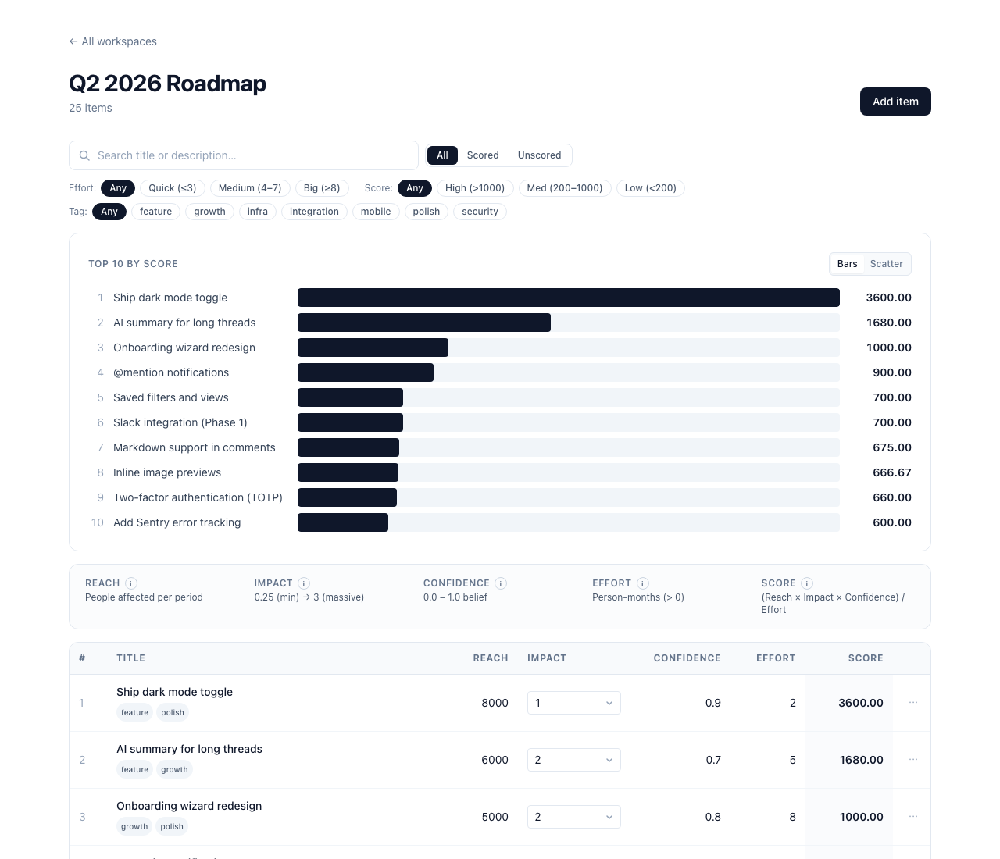
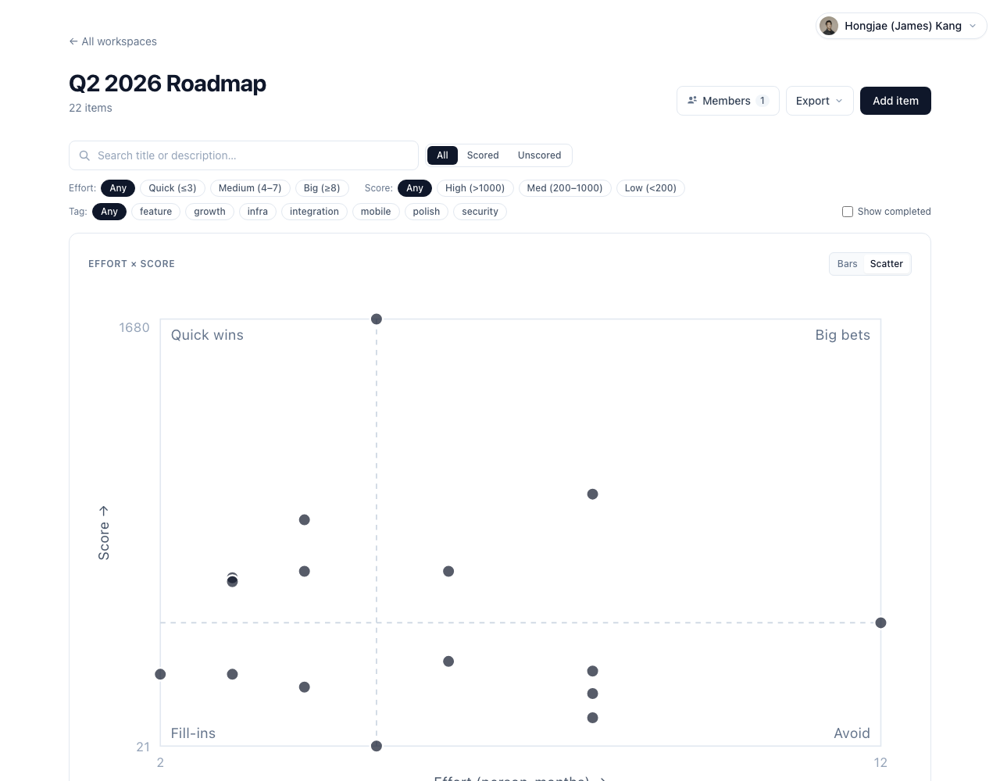
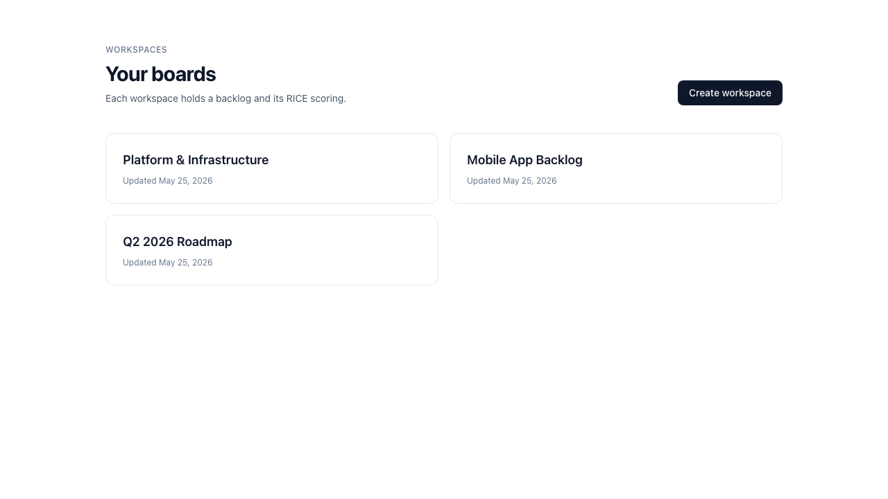
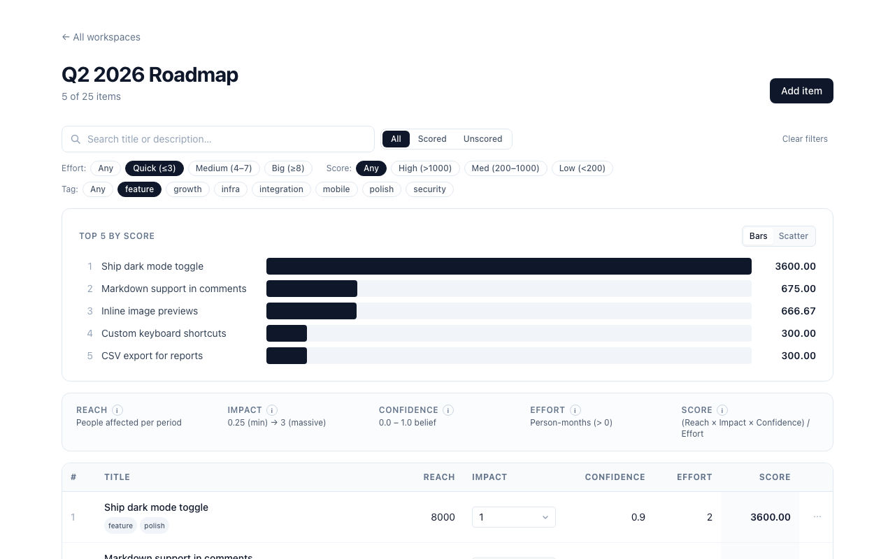
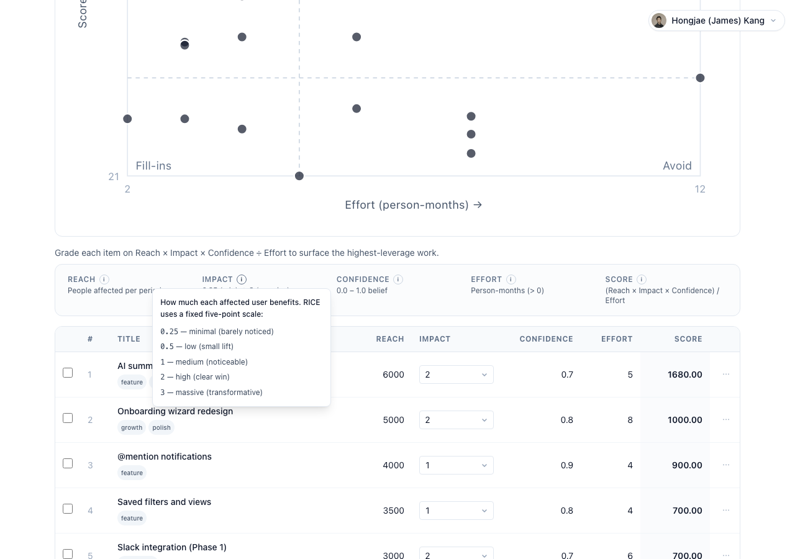
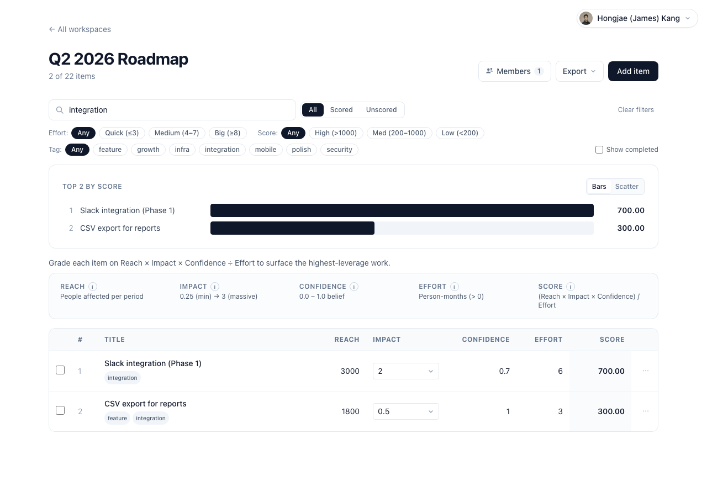

<div align="center">

# Frameboard

**An open-source workspace for product teams to run RICE, ICE, MoSCoW, and Kano prioritization — without leaving the browser.**

### 🚀 [Live demo → frameboard.pages.dev](https://frameboard.pages.dev)

[](https://opensource.org/licenses/MIT)
[](CONTRIBUTING.md)
[](#status)
[](https://github.com/james-kanghj/frameboard/actions/workflows/ci.yml)
[](https://github.com/james-kanghj/frameboard/stargazers)
[](https://github.com/james-kanghj/frameboard/commits/main)
[](https://github.com/james-kanghj/frameboard/issues)
[](https://www.typescriptlang.org)
[](https://nextjs.org)
[](https://tailwindcss.com)
[](https://fastapi.tiangolo.com)
[](https://claude.com/claude-code)

</div>

---

## Screenshots

The board at a glance — filter bar, top-10 bar chart, and the table:



<table>
  <tr>
    <td width="50%"><strong>Effort × Score scatter (RICE)</strong><br><sub>PM's classic 2×2 quadrant: Quick wins / Big bets / Fill-ins / Avoid</sub></td>
    <td width="50%"><strong>Multiple workspaces, multiple frameworks</strong><br><sub>Each workspace picks its own scoring framework — RICE, ICE, Value × Effort, or MoSCoW</sub></td>
  </tr>
  <tr>
    <td><a href="./docs/screenshots/02-scatter-view.png"></a></td>
    <td><a href="./docs/screenshots/03-workspaces-list.png"></a></td>
  </tr>
  <tr>
    <td width="50%"><strong>Effort + Tag chip filters</strong><br><sub>Quick (≤3) effort + <code>feature</code> tag narrows 25 items to a focused slice — Score bucket sits alongside, ready to layer on</sub></td>
    <td width="50%"><strong>Inline (i) tooltips on every metric</strong><br><sub>Hover, focus, or tap for the RICE-specific scale (0.25 → 3 etc.)</sub></td>
  </tr>
  <tr>
    <td><a href="./docs/screenshots/05-filter-buckets.png"></a></td>
    <td><a href="./docs/screenshots/06-tooltip-impact.png"></a></td>
  </tr>
  <tr>
    <td colspan="2"><strong>Live text search — title + description with URL state</strong><br><sub>e.g. <code>?q=integration&status=scored&view=scatter</code> survives refresh and is shareable</sub></td>
  </tr>
  <tr>
    <td colspan="2"><a href="./docs/screenshots/04-filter-search.png"></a></td>
  </tr>
</table>

> Regenerate any time with `pnpm --filter @frameboard/web exec node scripts/capture-screenshots.mjs`. Defaults target the live deployment; pass `BASE=http://localhost:3000 WS_Q2=<id>` to capture from a local dev server before pushing changes that aren't deployed yet.

## Why Frameboard?

Product managers waste hours each sprint debating "what to build next" in spreadsheets, sticky notes, and Slack threads. Existing tools either lock you into one framework (Jira, Linear) or charge per seat for what should be a 10-minute decision.

**Frameboard is different:**

- 🧮 **Multi-framework** — Pick RICE, ICE, Value × Effort, or MoSCoW per workspace. Each board renders inputs, metric legend, and scoring formula tailored to the framework you picked
- 🔐 **Sign in with GitHub** — NextAuth on the frontend, JWT-verified ownership checks on the backend. `AUTH_DISABLED=1` bypass for self-hosters who don't want OAuth
- 📊 **PM-shaped visuals** — Top-N bar chart and Effort × Score scatter (Quick wins / Big bets / Fill-ins / Avoid) on RICE boards; URL-synced filters (`?q=…&status=…&effort=…&score=…&tag=…`) for sharing a working view
- 🚀 **Self-hostable** — One Docker command. Your data stays yours

## Status

Alpha, built in the open. **Live and deployed** at [frameboard.pages.dev](https://frameboard.pages.dev) (Cloudflare Pages frontend + Render backend + Neon Postgres). End-to-end happy path is functional: create a workspace, add items, score them with RICE, edit inline or via modal, delete.

| Layer | Status |
|---|---|
| Database schema | ✅ Users, workspaces, items (with completion), RICE scores, polymorphic `item_scores`, history log |
| Backend API | ✅ Full CRUD + RICE/ICE/MoSCoW/ValueEffort scoring + item tags + completion + history log + Notion export (110 pytest tests) |
| Frontend workspace list + board | ✅ Create (with framework picker), score, edit (modal + inline for RICE), delete, tag, complete |
| Multi-framework scoring | ✅ Backend (`POST /v1/score`, `workspace.framework`, polymorphic `item_scores`) and frontend both shipped. Custom framework dropdown on the create modal; ICE / MoSCoW / Value × Effort each render a dedicated polymorphic board with framework-aware inputs, metric legend, (i) tooltips, and intro line |
| Auth | ✅ GitHub OAuth via NextAuth.js + HS256 JWT verification on the backend. Floating user badge (avatar + email + Sign out) on every page. `AUTH_DISABLED=1` bypass for self-host / local dev |
| Item completion | ✅ Per-row checkbox on every board. Checked items render strikethrough + dimmed and sink to the bottom regardless of score. Hidden by default; "Show completed" filter toggle mixes them back in for retrospectives. Mark/unmark events captured in the item history log |
| Visualization & filtering | ✅ Top-10 bars + Effort × Score scatter (RICE), search / status / effort / score / tag chips, URL-synced state |
| Metric tooltips | ✅ Inline (i) on every framework's metric legend (RICE / ICE / MoSCoW / Value × Effort) |
| Self-host Docker image | ✅ `docker compose -f docker-compose.selfhost.yml up --build` brings up the full stack |
| End-to-end test suite | ✅ 5 Playwright scenarios, green in CI |
| Production deployment | ✅ Cloudflare Pages + Render + Neon |

## Quick start

```bash
# Clone
git clone https://github.com/james-kanghj/frameboard.git
cd frameboard

# Install JS dependencies
pnpm install
pnpm approve-builds       # approve native build scripts (sharp, unrs-resolver)

# Start Postgres
docker compose up -d db

# Set up backend
cd apps/api
python3 -m venv .venv
source .venv/bin/activate
pip install -e ".[dev]"
cp .env.example .env.local
alembic upgrade head      # creates all four tables
cd ../..

# Set up frontend env
cp apps/web/.env.example apps/web/.env.development.local
# Defaults point the FE at http://localhost:8001
```

Then in two terminals:

```bash
# Terminal A — backend
cd apps/api && source .venv/bin/activate
uvicorn app.main:app --reload --port 8001
```

```bash
# Terminal B — frontend
pnpm --filter @frameboard/web dev
```

Open [http://localhost:3000/workspaces](http://localhost:3000/workspaces).

See [docs/SETUP.md](docs/SETUP.md) for the full guide, including notes on port choices and common pitfalls.

### Self-host with Docker

If you'd rather run the whole stack as containers (no local Python / pnpm install required):

```bash
docker compose -f docker-compose.selfhost.yml up -d --build
```

Brings up Postgres (`:5433`), the FastAPI backend (`:8001`), and the Next.js frontend (`:3000`). The backend auto-runs Alembic migrations on boot, so a fresh DB initializes itself. Override the build args in `docker-compose.selfhost.yml` if you're hosting under a custom domain — `NEXT_PUBLIC_API_BASE_URL` is inlined at build time and needs a rebuild to change.

### Production auth setup

Local dev and self-host can skip auth (`AUTH_DISABLED=1` on the API,
`NEXT_PUBLIC_AUTH_DISABLED=1` on the web). For a public deployment with
sign-in, register a GitHub OAuth app and wire it through:

1. **Register the OAuth app** at <https://github.com/settings/developers>
   with the authorization callback URL set to
   `https://<your-domain>/api/auth/callback/github`.
2. **Generate a 32-byte secret**: `openssl rand -base64 32`. Both the
   Next.js app and the FastAPI backend must use the same value
   (HS256 JWT signing key).
3. **Web env (Cloudflare Pages)**: set `NEXTAUTH_SECRET`,
   `NEXTAUTH_URL=https://<your-domain>`, `GITHUB_ID`, `GITHUB_SECRET`.
   Leave `NEXT_PUBLIC_AUTH_DISABLED` unset.
4. **API env (Render)**: set the same `NEXTAUTH_SECRET`. Leave
   `AUTH_DISABLED` unset (defaults to `0`).

Backend ownership checks (`require_workspace_owner`,
`_load_owned_item`) then gate every workspace / item / score endpoint
on the JWT's `email` claim.

## Tech stack

| Layer    | Tech                                                       |
| -------- | ---------------------------------------------------------- |
| Frontend | Next.js 15 (App Router), TypeScript, Tailwind, shadcn/ui   |
| Backend  | FastAPI, Python 3.12+, SQLAlchemy 2.0, Alembic             |
| Database | PostgreSQL 16 (Dockerized, port `5433` to avoid conflicts) |
| Monorepo | pnpm workspaces + Turborepo                                |
| Testing  | pytest (110 tests, backend), Playwright (5 e2e scenarios)  |
| Deploy   | Cloudflare Pages (frontend) + Render (backend) + Neon (DB) |
| CI       | GitHub Actions — web, api, e2e jobs all gated on PRs       |

## Roadmap

- [x] Monorepo scaffolding (Next.js + FastAPI + Postgres)
- [x] Alembic migrations + initial schema
- [x] Workspace and backlog item CRUD endpoints
- [x] RICE score persistence with upsert + board endpoint
- [x] Frontend API client + workspace list page
- [x] RICE scoring board UI (sortable, inline edit)
- [x] Item create/edit modal
- [x] End-to-end smoke tests (Playwright, 5 scenarios)
- [x] CI pipeline (web + api + e2e jobs)
- [x] Public hosted instance ([frameboard.pages.dev](https://frameboard.pages.dev))
- [x] Score distribution chart (top-N horizontal bars above the table)
- [x] Effort × Score scatter plot (PM-style 2×2 quadrant, tab-toggled with the bar chart)
- [x] Board search — title + description, with URL state (`?q=`)
- [x] Board status filter — All / Scored / Unscored segmented toggle (URL `?status=`)
- [x] Board quick-wins filter — effort + score bucket chips (URL `?effort=` `?score=`)
- [x] Metric legend tooltips — `(i)` buttons explain Reach / Impact (0.25→3 scale) / Confidence / Effort / Score
- [x] Self-host Docker image — `docker compose -f docker-compose.selfhost.yml up --build` brings up Postgres + API + Web
- [x] Item tags / categories — JSON column on items, pill input in the edit modal, tag chip filter on the board (URL `?tag=`)
- [x] Score history / change-log timeline per item — append-only `item_history` table records RICE changes and field edits; collapsible timeline in the edit modal
- [x] ICE / MoSCoW / Value-vs-Effort frameworks — backend: `workspace.framework`, polymorphic `item_scores` table, unified `POST /v1/score`, framework-aware board ordering. Frontend: custom framework picker on the create-workspace modal, dedicated polymorphic board for non-RICE workspaces with per-framework inputs (1–10 sliders for ICE, V/E numeric pair for Value × Effort, Must/Should/Could/Won't select for MoSCoW), framework-aware metric legend, (i) tooltips, and an intro line per board.
- [x] Multi-user auth (NextAuth.js + JWT) — GitHub OAuth on the frontend, HS256 JWT verification on the backend with cross-user ownership checks on every endpoint. Floating user badge on every page (avatar + email + Sign out). `AUTH_DISABLED=1` bypass for self-host / local dev (mirrored on both sides).
- [x] Item completion — nullable `completed_at` on `backlog_items` (migration 0006), checkbox column on every board, completed items strikethrough + sink to the bottom regardless of score. "Show completed" filter toggle (URL `?completed=show`) mixes them back in for retros. History log captures mark/unmark events automatically via the field-diff hook.
- [~] CSV / Jira / Linear / Notion export — CSV (client-side, framework-aware columns) and Notion (server-side, integration-token + database id, per-user setup flow in the export menu, partial-success reporting) both shipped. Linear / Jira integrations still TODO.
- [ ] Collaborative scoring with disagreement visualization

See [GitHub Projects](https://github.com/james-kanghj/frameboard/projects) for the live board.

## Contributing

Contributions are welcome — from typo fixes to new prioritization frameworks. See [CONTRIBUTING.md](CONTRIBUTING.md).

## Maintainer

Built and maintained by [James](https://github.com/james-kanghj) — a 15-year QA/SDET engineer pivoting to product management. Frameboard is the tool I wished my product managers had used.

## Built with Claude Code

Frameboard was bootstrapped from an empty repo to a live production deployment in a single focused day, paired with [Claude Code](https://claude.com/claude-code) as a pair-programming partner. The commit history, CI runs, and architecture decisions are all public — useful as a reference for other solo builders evaluating LLM-assisted development workflows.

## License

[MIT](LICENSE)